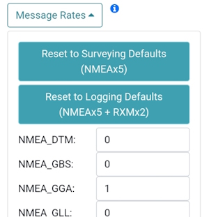
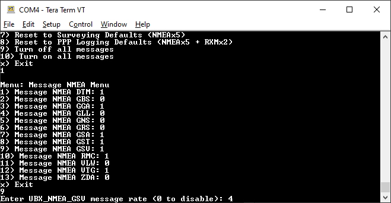

# Messages Menu

Surveyor:  / Express:  / Express Plus:  / Facet:  / Facet L-Band:  / Reference Station: 

*Message rate configuration from WiFi AP Config*

*The messages configuration menu*

From this menu, a user can control the output of various NMEA, RTCM, RXM, and other messages. Any enabled message will be broadcast over Bluetooth *and* recorded to SD (if available).

Because of the large number of configurations possible, we provide a few common settings:

* Reset to Surveying Defaults (NMEAx5)
* Reset to PPP Logging Defaults (NMEAx5 + RXMx2)
* Turn off all messages (serial command only)
* Turn on all messages (serial command only)

## Reset to Surveying Defaults (NMEAx5)

This will turn off all messages and enable the following messages:

* NMEA-GGA, NMEA-GSA, NMEA-GST, NMEA-GSV, NMEA-RMC

These five NMEA sentences are commonly used with SW Maps for general surveying.

## Reset to PPP Logging Defaults (NMEAx5 + RXMx2)

This will turn off all messages and enable the following messages:

* NMEA-GGA, NMEA-GSA, NMEA-GST, NMEA-GSV, NMEA-RMC, RXM-RAWX, RXM-SFRBX

These seven sentences are commonly used when logging and doing Precise Point Positioning (PPP) or Post Processed Kinematics (PPK). You can read more about PPP [here](https://learn.sparkfun.com/tutorials/how-to-build-a-diy-gnss-reference-station).

## Individual Messages

*Configuring the NMEA messages*

There are a large number of messages supported (listed below). Each message sub-menu will present the user with the ability to set the message report rate.

Each message rate input controls which messages are disabled (0) and how often the message is reported (1 = one message reported per 1 fix, 5 = one report every 5 fixes). The message rate range is 0 to 20.

**Note:** The message report rate is the *number of fixes* between message reports. In the image above, with GSV set to 4, the NMEA GSV message will be produced once every 4 fixes. Because the device defaults to a 4Hz fix rate, the GSV message will appear once per second.

The following 120 messages are supported for Bluetooth output and logging:

<table class="table">
 <table>
  <COLGROUP><COL WIDTH=200><COL WIDTH=200><COL WIDTH=200></COLGROUP>
  <tr>
  	<td>&#8226; NMEA-DTM</td>
	  <td>&#8226; NMEA-GBS</td>
	  <td>&#8226; NMEA-GGA</td>
  </tr>
  <tr>
	  <td>&#8226; NMEA-GLL</td>
	  <td>&#8226; NMEA-GNS</td>
	  <td>&#8226; NMEA-GRS</td>
  </tr>
  <tr>
	  <td>&#8226; NMEA-GSA</td>
	  <td>&#8226; NMEA-GST</td>
	  <td>&#8226; NMEA-GSV</td>
  </tr>
  <tr>
	  <td>&#8226; NMEA-RLM</td>
	  <td>&#8226; NMEA-RMC</td>
	  <td>&#8226; NMEA-THS</td>
  </tr>
  <tr>
	  <td>&#8226; NMEA-VLW</td>
	  <td>&#8226; NMEA-VTG</td>
    <td>&#8226; NMEA-ZDA</td>
  </tr>
  <tr>
	  <td>&#8226; NMEA-NAV2-GGA</td>
	  <td>&#8226; NMEA-NAV2-GLL</td>
	  <td>&#8226; NMEA-NAV2-GNS</td>
  </tr>
  <tr>
	  <td>&#8226; NMEA-NAV2-GSA</td>
	  <td>&#8226; NMEA-NAV2-RMC</td>
	  <td>&#8226; NMEA-NAV2-VTG</td>
  </tr>
  <tr>
    <td>&#8226; NMEA-NAV2-ZDA</td>
    <td>&#8226; PUBX-POLYP</td>
    <td>&#8226; PUBX-POLYS</td>
  </tr>
  <tr>
    <td>&#8226; PUBX-POLYT</td>
    <td>&#8226; RTCM3x-1005</td>
    <td>&#8226; RTCM3x-1074</td>
  </tr>
  <tr>
    <td>&#8226; RTCM3x-1077</td>
    <td>&#8226; RTCM3x-1084</td>
    <td>&#8226; RTCM3x-1087</td>
  </tr>
  <tr>
    <td>&#8226; RTCM3x-1094</td>
    <td>&#8226; RTCM3x-1097</td>
    <td>&#8226; RTCM3x-1124</td>
  </tr>
  <tr>
    <td>&#8226; RTCM3x-1127</td>
    <td>&#8226; RTCM3x-1230</td>
    <td>&#8226; RTCM3x-4072-0</td>
  </tr>
  <tr>
    <td>&#8226; RTCM3x-4072-1</td>
    <td>&#8226; ESF-ALG</td>
    <td>&#8226; ESF-INS</td>
  </tr>
  <tr>
    <td>&#8226; ESF-MEAS</td>
    <td>&#8226; ESF-RAW</td>
    <td>&#8226; ESF-STATUS</td>
  </tr>
  <tr>
    <td>&#8226; MON-COMMS</td>
    <td>&#8226; MON-HW2</td>
    <td>&#8226; MON-HW3</td>
  </tr>
  <tr>
    <td>&#8226; MON-HW</td>
    <td>&#8226; MON-IO</td>
    <td>&#8226; MON-MSGPP</td>
  </tr>
  <tr>
    <td>&#8226; MON-RF</td>
    <td>&#8226; MON-RXBUF</td>
    <td>&#8226; MON-RXR</td>
  </tr>
  <tr>
    <td>&#8226; MON-SPAN</td>
    <td>&#8226; MON-SYS</td>
    <td>&#8226; MON-TXBUF</td>
  </tr>
  <tr>
    <td>&#8226; NAV2-CLOCK</td>
    <td>&#8226; NAV2-COV</td>
    <td>&#8226; NAV2-DOP</td>
  </tr>
  <tr>
    <td>&#8226; NAV2-EELL</td>
    <td>&#8226; NAV2-EOE</td>
    <td>&#8226; NAV2-POSECEF</td>
  </tr>
  <tr>
    <td>&#8226; NAV2-POSLLH</td>
    <td>&#8226; NAV2-PVAT</td>
    <td>&#8226; NAV2-PVT</td>
  </tr>
  <tr>
    <td>&#8226; NAV2-SAT</td>
    <td>&#8226; NAV2-SBAS</td>
    <td>&#8226; NAV2-SIG</td>
  </tr>
  <tr>
    <td>&#8226; NAV2-STATUS</td>
    <td>&#8226; NAV2-TIMEBDS</td>
    <td>&#8226; NAV2-TIMEGAL</td>
  </tr>
  <tr>
    <td>&#8226; NAV2-TIMEGLO</td>
    <td>&#8226; NAV2-TIMEGPS</td>
    <td>&#8226; NAV2-TIMELS</td>
  </tr>
  <tr>
    <td>&#8226; NAV2-TIMEQZSS</td>
    <td>&#8226; NAV2-TIMEUTC</td>
    <td>&#8226; NAV2-VELECEF</td>
  </tr>
  <tr>
    <td>&#8226; NAV2-VELNED</td>
    <td>&#8226; NAV-ATT</td>
    <td>&#8226; NAV-CLOCK</td>
  </tr>
  <tr>
    <td>&#8226; NAV-COV</td>
    <td>&#8226; NAV-DOP</td>
    <td>&#8226; NAV-EELL</td>
  </tr>
  <tr>
    <td>&#8226; NAV-EOE</td>
    <td>&#8226; NAV-GEOFENCE</td>
    <td>&#8226; NAV-HPPOSECEF</td>
  </tr>
  <tr>
    <td>&#8226; NAV-HPPOSLLH</td>
    <td>&#8226; NAV-ODO</td>
    <td>&#8226; NAV-ORB</td>
  </tr>
  <tr>
    <td>&#8226; NAV-PL</td>
    <td>&#8226; NAV-POSECEF</td>
    <td>&#8226; NAV-POSLLH</td>
  </tr>
  <tr>
    <td>&#8226; NAV-PVAT</td>
    <td>&#8226; NAV-PVT</td>
    <td>&#8226; NAV-RELPOSNED</td>
  </tr>
  <tr>
    <td>&#8226; NAV-SAT</td>
    <td>&#8226; NAV-SBAS</td>
    <td>&#8226; NAV-SIG</td>
  </tr>
  <tr>
    <td>&#8226; NAV-SLAS</td>
    <td>&#8226; NAV-STATUS</td>
    <td>&#8226; NAV-SVIN</td>
  </tr>
  <tr>
    <td>&#8226; NAV-TIMEBDS</td>
    <td>&#8226; NAV-TIMEGAL</td>
    <td>&#8226; NAV-TIMEGLO</td>
  </tr>
  <tr>
    <td>&#8226; NAV-TIMEGPS</td>
    <td>&#8226; NAV-TIMELS</td>
    <td>&#8226; NAV-TIMEQZSS</td>
  </tr>
  <tr>
    <td>&#8226; NAV-TIMEUTC</td>
    <td>&#8226; NAV-VELECEF</td>
    <td>&#8226; NAV-VELNED</td>
  </tr>
  <tr>
    <td>&#8226; RXM-COR</td>
    <td>&#8226; RXM-MEASX</td>
    <td>&#8226; RXM-RAWX</td>
  </tr>
  <tr>
    <td>&#8226; RXM-RLM</td>
    <td>&#8226; RXM-RTCM</td>
    <td>&#8226; RXM-SFRBX</td>
  </tr>
  <tr>
    <td>&#8226; RXM-SPARTN</td>
    <td>&#8226; TIM-TM2</td>
    <td>&#8226; TIM-TP</td>
  </tr>
  <tr>
    <td>&#8226; TIM-VRFY</td>
    <td></td>
    <td></td>
  </tr>

</table></table>

## Turn off all messages

This will turn off all messages. This is handy for advanced users who need to start from a blank slate. This setting is only available over serial configuration.

## Turn on all messages

This will turn on all messages. This is a setting used for firmware testing and should not be needed in normal use. This setting is only available over serial configuration.

## ESF Messages

The ZED-F9R module, found only on the Express Plus, supports additional External Sensor Fusion messages. These messages show the raw accelerometer and gyroscope values of the internal IMU. These messages can consume up to 34,000 bytes of bandwidth. Please see [here](https://github.com/sparkfun/SparkFun_RTK_Firmware/issues/81#issuecomment-1059338377) for more information.